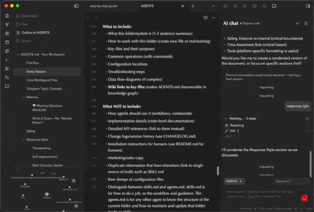

# AI Chat Sidebar

AI Chat Sidebar is a desktop-only Obsidian plugin that adds an AI chat sidebar with Claude Max OAuth support, an Anthropic API key fallback, and optional ChatGPT Plus/Codex support.

## Demo



## Features

- AI chat sidebar inside Obsidian
- Claude Max OAuth sign-in
- Anthropic API key fallback
- ChatGPT Plus/Codex OAuth sign-in
- Streaming responses
- Active note context and file mentions
- Multi-file diff review UI

## Support

For support, updates, and product notes, visit [theindie.app](https://theindie.app/).
You can also email [yourfriend@indieapp.app](mailto:yourfriend@indieapp.app).

## Disclosures

- Account requirements: Claude Max, an Anthropic API key, or ChatGPT Plus/OpenAI access is required depending on the selected provider.
- Network use: prompts, active note context, selected text, file mentions, and generated responses may be sent to Anthropic/Claude or OpenAI services depending on the selected provider.
- Local token storage: API keys, OAuth tokens, refresh tokens, selected models, and chat session identifiers are stored in this vault's Obsidian plugin data.
- File access: by default, the plugin can include the active markdown note in chat context. File mentions can reference additional vault files.
- Agent edits: when asked to edit notes, the bridge may let the selected AI agent modify files in the vault. Review generated diffs before relying on changes.
- Runtime files: bridge scripts are bundled into `main.js` and written under the installed plugin folder so the marketplace package can stay limited to Obsidian's standard release files.
- Telemetry and ads: this plugin does not collect client-side telemetry and does not display ads.

## Development

```bash
npm install
npm run dev
```

Production build:

```bash
npm run build
```

The Marketplace release artifact is the bundled Obsidian plugin surface:

- `main.js`
- `manifest.json`
- `styles.css`

The Claude and Pi bridges, plus the Claude SDK CLI runtime, are bundled into
`main.js` and materialized at runtime under the installed plugin folder. Do not
attach files from `scripts/` as Marketplace release assets.

Do not commit local plugin state files such as `.env`, `data.json`, or generated logs.
